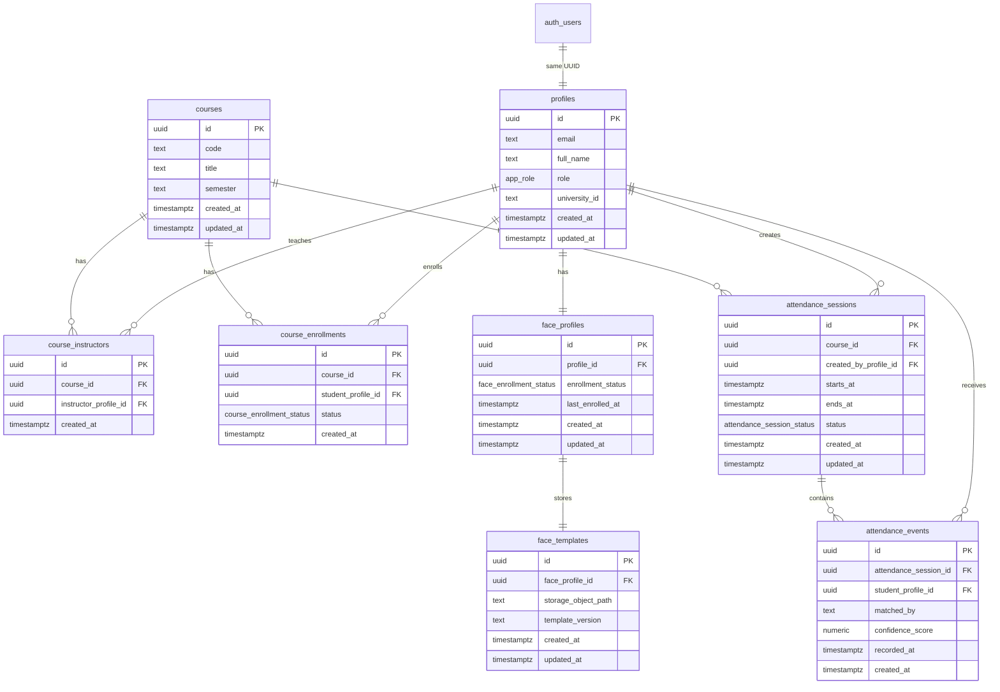

# Database Architecture Report

This report documents the current database architecture defined by the SQL migrations under `supabase/migrations/` and the way the application uses that schema today.

## 1. Database Platform Overview

The project uses Supabase as the backend platform:

- authentication: Supabase Auth
- application database: Supabase Postgres
- file storage: Supabase Storage
- schema management: SQL migrations checked into the repository

The current migration set is:

- `20260326170000_initial_schema.sql`
- `20260327110000_face_storage.sql`
- `20260409111500_add_university_id.sql`
- `20260413235900_update_handle_new_user_for_invites.sql`

## 2. Database Model in One View

## 3. Enum Types

| Enum | Values | Used by |
| --- | --- | --- |
| `public.app_role` | `student`, `instructor`, `admin` | `profiles.role` |
| `public.course_enrollment_status` | `active`, `dropped` | `course_enrollments.status` |
| `public.attendance_session_status` | `draft`, `open`, `closed`, `archived` | `attendance_sessions.status` |
| `public.face_enrollment_status` | `not_started`, `pending`, `complete`, `reset_required` | `face_profiles.enrollment_status` |

## 4. Table-by-Table Documentation

## 4.1 `public.profiles`

Purpose:

- the main application user table
- stores role and academic identity data for each auth user

Relationship:

- one `profiles.id` equals one `auth.users.id`

| Column | Type | Key details |
| --- | --- | --- |
| `id` | `uuid` | Primary key, foreign key to `auth.users(id)`, cascades on delete |
| `email` | `text` | Required, unique |
| `full_name` | `text` | Optional display name |
| `role` | `public.app_role` | Required, defaults to `student` |
| `university_id` | `text` | Unique 8-digit academic ID in current workflows, added later by migration |
| `created_at` | `timestamptz` | Defaults to UTC now |
| `updated_at` | `timestamptz` | Defaults to UTC now, maintained by trigger |

Application usage:

- login redirects by `role`
- dashboards label the user from `full_name` or `email`
- biometric enrollment searches students by `university_id`
- admin workflows list and mutate users through this table

## 4.2 `public.courses`

Purpose:

- stores the academic course catalog used by attendance and assignments

| Column | Type | Key details |
| --- | --- | --- |
| `id` | `uuid` | Primary key |
| `code` | `text` | Required course code |
| `title` | `text` | Required course title |
| `semester` | `text` | Required semester label |
| `created_at` | `timestamptz` | UTC now by default |
| `updated_at` | `timestamptz` | Updated by trigger |

Constraint:

- unique `(code, semester)` so the same code can repeat in another term but not within one term

## 4.3 `public.course_instructors`

Purpose:

- maps instructors to courses

| Column | Type | Key details |
| --- | --- | --- |
| `id` | `uuid` | Primary key |
| `course_id` | `uuid` | FK to `courses.id`, cascades on delete |
| `instructor_profile_id` | `uuid` | FK to `profiles.id`, cascades on delete |
| `created_at` | `timestamptz` | UTC now by default |

Constraint:

- unique `(course_id, instructor_profile_id)` so the same instructor cannot be assigned twice to the same course

Application usage:

- instructor dashboard
- instructor course dropdowns
- route-level course ownership checks
- admin course assignment page

## 4.4 `public.course_enrollments`

Purpose:

- maps students to courses

| Column | Type | Key details |
| --- | --- | --- |
| `id` | `uuid` | Primary key |
| `course_id` | `uuid` | FK to `courses.id`, cascades on delete |
| `student_profile_id` | `uuid` | FK to `profiles.id`, cascades on delete |
| `status` | `public.course_enrollment_status` | Defaults to `active` |
| `created_at` | `timestamptz` | UTC now by default |

Constraint:

- unique `(course_id, student_profile_id)` so a student cannot be enrolled twice in the same course

Application usage:

- student history scope
- instructor reports
- attendance validation
- auto-enrollment during biometric onboarding

## 4.5 `public.attendance_sessions`

Purpose:

- stores each attendance session for a course

| Column | Type | Key details |
| --- | --- | --- |
| `id` | `uuid` | Primary key |
| `course_id` | `uuid` | FK to `courses.id`, cascades on delete |
| `created_by_profile_id` | `uuid` | FK to `profiles.id`, restricted on delete |
| `starts_at` | `timestamptz` | Required |
| `ends_at` | `timestamptz` | Required |
| `status` | `public.attendance_session_status` | Defaults to `draft`, app usually uses `open` and `closed` |
| `created_at` | `timestamptz` | UTC now by default |
| `updated_at` | `timestamptz` | Updated by trigger |

Constraint:

- `ends_at > starts_at`

Application usage:

- instructor scanner creates or resumes open sessions
- archive and reports group data by session
- lateness is calculated against `starts_at`

## 4.6 `public.attendance_events`

Purpose:

- stores each successful student check-in for one attendance session

| Column | Type | Key details |
| --- | --- | --- |
| `id` | `uuid` | Primary key |
| `attendance_session_id` | `uuid` | FK to `attendance_sessions.id`, cascades on delete |
| `student_profile_id` | `uuid` | FK to `profiles.id`, cascades on delete |
| `matched_by` | `text` | Defaults to `manual`, app currently writes `facial_recognition` |
| `confidence_score` | `numeric(5,4)` | Optional, bounded by constraint to `0..1` |
| `recorded_at` | `timestamptz` | UTC now by default |
| `created_at` | `timestamptz` | UTC now by default |

Constraints:

- unique `(attendance_session_id, student_profile_id)`
- confidence score must be null or between 0 and 1

Application usage:

- student history
- instructor archive
- dashboard activity counts
- reports and CSV export

## 4.7 `public.face_profiles`

Purpose:

- tracks biometric enrollment state for each application user

| Column | Type | Key details |
| --- | --- | --- |
| `id` | `uuid` | Primary key |
| `profile_id` | `uuid` | Unique FK to `profiles.id`, cascades on delete |
| `enrollment_status` | `public.face_enrollment_status` | Defaults to `not_started` |
| `last_enrolled_at` | `timestamptz` | Updated after successful face enrollment |
| `created_at` | `timestamptz` | UTC now by default |
| `updated_at` | `timestamptz` | Updated by trigger |

Application usage:

- instructor enrollment candidate checks
- admin biometric reset lookup
- admin dashboard recent biometric status log

## 4.8 `public.face_templates`

Purpose:

- stores the relational pointer to the private stored face descriptor file

| Column | Type | Key details |
| --- | --- | --- |
| `id` | `uuid` | Primary key |
| `face_profile_id` | `uuid` | Unique FK to `face_profiles.id`, cascades on delete |
| `storage_object_path` | `text` | Unique path in Supabase Storage |
| `template_version` | `text` | Current code writes `face-api-ssd` |
| `created_at` | `timestamptz` | UTC now by default |
| `updated_at` | `timestamptz` | Updated by trigger |

Important note:

- the actual descriptor array is not stored inside this table
- the file content is stored in the private storage bucket

## 4.9 External identity and storage tables

### `auth.users`

- owned by Supabase Auth
- acts as the identity source
- each row is mirrored into `profiles` and `face_profiles` by the `handle_new_user()` trigger

### `storage.buckets` and `storage.objects`

- used for the private `face-templates` bucket
- access is controlled by storage policies

## 5. Relationship Summary

| From | To | Relationship | Meaning in the app |
| --- | --- | --- | --- |
| `auth.users` | `profiles` | 1:1 | every auth account should have one profile row |
| `profiles` | `face_profiles` | 1:1 | every user gets one biometric status row |
| `face_profiles` | `face_templates` | 1:1 | each biometric profile can point to one current stored template |
| `courses` | `course_instructors` | 1:many | a course can have multiple instructors |
| `courses` | `course_enrollments` | 1:many | a course can have many enrolled students |
| `courses` | `attendance_sessions` | 1:many | each course can have many sessions |
| `attendance_sessions` | `attendance_events` | 1:many | each session can have many check-ins |
| `profiles` | `attendance_events` | 1:many | a student can have many attendance events across sessions |

## 6. Indexes

Defined indexes:

- `course_instructors_course_id_idx`
- `course_instructors_instructor_profile_id_idx`
- `course_enrollments_course_id_idx`
- `course_enrollments_student_profile_id_idx`
- `attendance_sessions_course_id_idx`
- `attendance_events_student_profile_id_idx`
- `attendance_events_session_id_idx`
- `face_profiles_profile_id_idx`
- `profiles_university_id_idx`

Why they matter:

- instructor course lookup is frequent
- student history and report queries often filter by course or student
- attendance scanners repeatedly need session- and student-based lookups
- university ID lookup is critical for instructor enrollment and admin reset

## 7. Triggers and Helper Functions

## 7.1 Timestamp trigger

Function:

- `public.set_updated_at()`

Used by triggers on:

- `profiles`
- `courses`
- `attendance_sessions`
- `face_profiles`
- `face_templates`

## 7.2 Auth bootstrap trigger

Function:

- `public.handle_new_user()`

Trigger:

- `on_auth_user_created` on `auth.users`

Current behavior:

- inserts or updates the `profiles` row
- copies `full_name`, `role`, and `university_id` from auth metadata when present
- inserts a `face_profiles` row if missing

This is especially important for admin invite onboarding, because the app sends role and generated university ID in auth metadata during invite creation.

## 7.3 RLS helper functions

The schema defines helper functions that RLS policies use:

- `public.current_user_role()`
- `public.is_admin()`
- `public.is_instructor_for_course(course_id uuid)`
- `public.is_enrolled_in_course(course_id uuid)`

These functions encode the core access rules once and then reuse them in policy definitions.

## 8. Row Level Security

RLS is enabled on:

- `profiles`
- `courses`
- `course_instructors`
- `course_enrollments`
- `attendance_sessions`
- `attendance_events`
- `face_profiles`
- `face_templates`

### Policy summary

| Table | Who can read | Who can write |
| --- | --- | --- |
| `profiles` | owner or admin | owner can update non-role fields, admin can manage all |
| `courses` | related instructor, related student, or admin | admin only |
| `course_instructors` | related instructor, enrolled student, or admin | admin only |
| `course_enrollments` | enrolled student, related instructor, or admin | admin only |
| `attendance_sessions` | related instructor, enrolled student, or admin | instructors can insert/update their own course sessions; admin can manage all |
| `attendance_events` | matched student, related instructor, or admin | instructors can insert for enrolled students in their course sessions; admin can manage all |
| `face_profiles` | owner or admin | admin only for management |
| `face_templates` | admin only | admin only |

Important architectural detail:

- instructors do not read storage objects directly under normal user RLS
- the app uses the server-only admin client for privileged template access during enrollment and attendance

## 9. Storage Bucket Usage

Migration `20260327110000_face_storage.sql` creates:

- bucket ID: `face-templates`
- private bucket: `public = false`
- file size limit: `5242880`
- allowed mime types:
  - `application/octet-stream`
  - `application/json`
  - `image/jpeg`
  - `image/png`

Current application behavior:

- the code uploads JSON face descriptor arrays
- `features/face/face.service.ts` stores them under:
  - `faceProfileId/template.json`

Storage policies currently allow:

- admin select
- admin insert
- admin update
- admin delete

This is why instructor flows must go through a privileged server action instead of talking to storage directly from the browser.

## 10. How Application Features Depend on the Schema

| Feature | Tables involved | Why those tables matter |
| --- | --- | --- |
| Login redirect | `profiles` | role lookup after auth sign-in |
| Invite onboarding | `auth.users`, `profiles`, `face_profiles` | bootstrap user identity and biometric status |
| Instructor dashboard | `course_instructors`, `course_enrollments`, `attendance_sessions`, `profiles` | assigned courses, student counts, session counts |
| Student dashboard/history | `course_enrollments`, `attendance_sessions`, `attendance_events`, `profiles` | scoped course list and present/late/absent reconstruction |
| Face enrollment | `profiles`, `face_profiles`, `face_templates`, `course_enrollments`, storage bucket | validate student, store descriptor, optionally add to course |
| Live attendance | `attendance_sessions`, `attendance_events`, `course_enrollments`, `profiles`, `face_templates`, storage bucket | verify session, match roster, persist attendance |
| Admin user management | `profiles`, `auth.users` | account lifecycle and role control |
| Course assignment | `courses`, `course_instructors` | create courses and map instructors |
| Face reset | `profiles`, `face_profiles`, `face_templates`, storage bucket | lookup and biometric deletion |

## 11. Data Lifecycle

## 11.1 User account lifecycle

1. A user signs up or is invited.
2. `auth.users` receives a row.
3. `handle_new_user()` creates or updates `profiles`.
4. `handle_new_user()` ensures a `face_profiles` row exists.
5. Admin workflows can later change role or university ID context.

## 11.2 Face enrollment lifecycle

1. Instructor looks up the student by `profiles.university_id`.
2. Descriptor JSON is uploaded to the private bucket.
3. `face_templates` stores the object path.
4. `face_profiles` changes to `complete` and records `last_enrolled_at`.

## 11.3 Attendance lifecycle

1. Instructor starts or resumes an `attendance_sessions` row.
2. Each accepted match becomes one `attendance_events` row.
3. History and reporting services rebuild student status from sessions plus events plus active enrollments.

## 11.4 Face reset lifecycle

1. Admin finds a student by UUID, email, or university ID.
2. The private storage object is deleted.
3. The `face_templates` row is deleted.
4. `face_profiles.enrollment_status` becomes `reset_required`.

## 12. Privacy and Security Implications

Strengths:

- biometric descriptors are not exposed as public assets
- RLS is enabled across all app tables
- service-role access is kept server-side
- duplicate attendance is blocked both by code and by database constraint

Current concerns:

- there is no dedicated audit table for biometric reset actions
- the retention period for face templates is not defined in code or schema
- the system stores descriptors as JSON in storage without an additional versioned retention model

## 13. Observed Inconsistencies and Limitations

- the admin reset UI says the action is audited through reports, but the schema has no dedicated biometric reset audit table
- the current docs in `docs/testing-face-id.md` still describe an older UUID-based enrollment flow
- `README.md` still references `.env.example`, but that file is absent from the current repository

## 14. Database Summary

The schema is well matched to the app's main use case:

- identity and roles live in `profiles`
- teaching structure lives in `courses`, `course_instructors`, and `course_enrollments`
- classroom execution lives in `attendance_sessions` and `attendance_events`
- biometric lifecycle lives in `face_profiles`, `face_templates`, and a private storage bucket

For a student project, this is a solid relational design because the data model follows the real flows of the app instead of storing everything in one broad user table.
