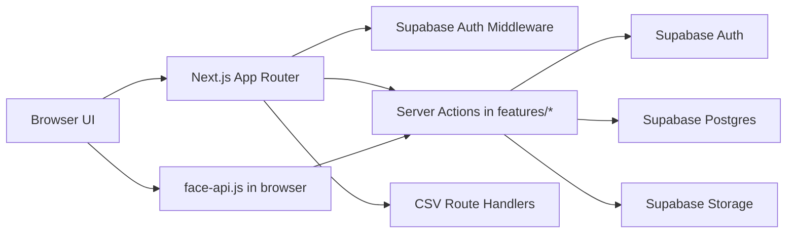
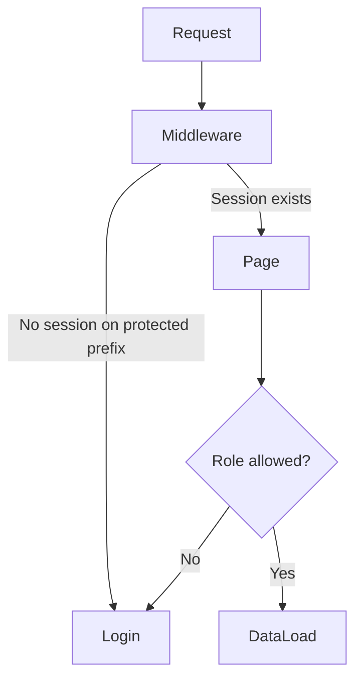
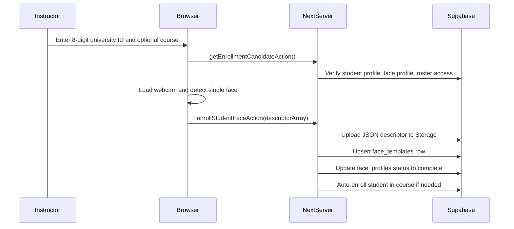

# Haga FaceID Full Project Report

This report was written from the current repository state after updating from `origin/main` on 2026-04-18. The source of truth used here is the live codebase, the current `changes.md`, the SQL migrations, the Supabase helpers, and the route/service files that power the app today.

## 1. Project Overview

Haga FaceID is a role-based university attendance system built with Next.js, React, TypeScript, Supabase, and `face-api.js`. Its main goal is to let instructors enroll students for biometric attendance, run live classroom scan sessions, and record attendance in a structured database that students and admins can review later.

The application is not split into separate frontend and backend repositories. Instead, it uses the Next.js App Router as the full application shell:

- the UI is rendered with server and client components inside `app/`
- authentication and database access are handled through Supabase
- business logic lives in server actions and service files inside `features/`
- reporting exports are handled by two small route handlers in `app/api/`

## 2. Project Purpose

The project solves a common attendance problem in educational settings:

- manual attendance is slow and easy to falsify
- instructors need a faster check-in process during class
- students need visibility into their own attendance history
- admins need control over users, course ownership, reporting, and biometric recovery

Instead of building a generic LMS, this system focuses on one narrow workflow and does it end to end:

- identify who the user is
- route them to the correct workspace
- allow biometric enrollment where needed
- run live recognition during a course session
- store attendance events safely
- show history and exports later

## 3. Users and Roles

| Role | Main responsibilities | Key pages |
| --- | --- | --- |
| Student | View attendance summary and attendance history | `/student/dashboard`, `/student/attendance-history` |
| Instructor | Manage assigned courses, enroll student face data, run attendance sessions, view archive and reports | `/instructor/dashboard`, `/instructor/enroll-student`, `/instructor/take-attendance`, `/instructor/class-attendance`, `/instructor/reports` |
| Admin | Manage users, create invited accounts, assign instructors to courses, reset face data, view global reports | `/admin/dashboard`, `/admin/user-management`, `/admin/course-assignment`, `/admin/reset-face-data`, `/admin/reports` |

## 4. Main Features

- Supabase email/password login
- invite-based onboarding for admin-created accounts
- middleware-based protection for `/student`, `/instructor`, and `/admin`
- role-aware redirects and guards
- instructor dashboard with live course/session counts
- student dashboard with attendance summary metrics
- student attendance history with present/late/absent calculation
- face enrollment using webcam capture and `face-api.js`
- live attendance scanning with browser-side face matching
- session-based attendance recording in Supabase
- late attendance detection
- duplicate attendance prevention
- instructor CSV report export
- admin user lifecycle tools
- admin course assignment tools
- admin biometric reset workflow

## 5. High-Level Architecture

### What this means in practice

- There is no standalone Express or Nest backend.
- The browser handles camera access and face descriptor extraction.
- The server side handles authorization, database writes, private storage access, and report generation.
- Supabase is both the authentication provider and the application database.

## 6. Technical Stack

| Layer | Technology | Notes |
| --- | --- | --- |
| App framework | Next.js 14.2.35 | App Router, route groups, server components, route handlers |
| UI | React 18.2.0 | Mix of server and client components |
| Language | TypeScript 5.3.3 | `strict` is disabled in `tsconfig.json` |
| Auth | Supabase Auth | Email/password plus invite onboarding |
| Database | Supabase Postgres | Relational schema managed through SQL migrations |
| Storage | Supabase Storage | Private `face-templates` bucket |
| Face recognition | `face-api.js` 0.22.2 | Models load from jsDelivr CDN in the browser |
| Email utility | Nodemailer | Present in codebase but not wired into the active flow |
| Testing | Playwright | Role-based E2E coverage for student, instructor, admin, and auth |
| Styling | Global CSS plus route-specific CSS files | `app/globals.css` imports `app/styles/*.css` |

## 7. Route and Page Overview

| Route | Purpose | Protection |
| --- | --- | --- |
| `/` | Redirect entry point to login | Public |
| `/login` | User sign-in and password reset request | Public |
| `/invite-callback` | Consumes invite tokens and establishes a session | Public, token-based |
| `/invite-setup` | Lets invited users set their password | Requires a valid invite session |
| `/student/dashboard` | Student summary cards | Student or admin |
| `/student/attendance-history` | Student attendance history | Student or admin |
| `/instructor/dashboard` | Instructor overview and quick actions | Instructor or admin |
| `/instructor/enroll-student` | Biometric enrollment workflow | Client-side role guard plus protected route |
| `/instructor/take-attendance` | Live attendance scanner | Client-side role guard plus protected route |
| `/instructor/class-attendance` | Grouped archive of sessions and student statuses | Instructor or admin |
| `/instructor/reports` | Instructor report generation and CSV export | Instructor or admin |
| `/admin/dashboard` | Admin overview metrics and recent activity | Admin |
| `/admin/user-management` | Search, role updates, deletion, reset shortcuts | Admin |
| `/admin/user-management/create` | Invite a new user account | Admin |
| `/admin/course-assignment` | Create courses and assign instructors | Admin |
| `/admin/reset-face-data` | Clear biometric data for a student | Admin |
| `/admin/reports` | Global report generation and CSV export | Admin |
| `/api/instructor/reports` | Download instructor CSV | Protected indirectly through service guard |
| `/api/admin/reports` | Download admin CSV | Protected indirectly through service guard |

## 8. Backend Overview

The backend logic is distributed across three patterns.

### 8.1 Supabase client helpers

- `lib/supabase/client.ts` creates a singleton browser client
- `lib/supabase/server.ts` creates a server client bound to Next.js cookies
- `lib/supabase/admin.ts` creates a service-role client for privileged operations
- `lib/supabase/middleware.ts` refreshes sessions and blocks anonymous access to protected route prefixes

### 8.2 Server actions

Most writes happen through `"use server"` files imported directly by pages:

- start and close attendance sessions
- enroll face data
- mark attendance
- ensure course enrollment
- create invited users
- change user roles
- delete users
- assign instructors to courses
- reset face data

This keeps business rules close to the feature layer instead of scattering raw queries inside page components.

### 8.3 Route handlers

The only explicit HTTP API endpoints are:

- `app/api/instructor/reports/route.ts`
- `app/api/admin/reports/route.ts`

Both call `getInstructorReportData()` and convert the result to CSV using `buildInstructorReportCsv()`.

## 9. Authentication and Authorization

### 9.1 Login flow

The login page:

- validates email and password on the client
- signs in with `supabase.auth.signInWithPassword`
- loads the user role from `profiles`
- waits for the Supabase auth cookie to persist
- performs a hard navigation to the correct dashboard

### 9.2 Invite onboarding flow

Admin-created users are invited through Supabase instead of being assigned a password directly.

The current invite sequence is:

1. Admin creates a user from `/admin/user-management/create`.
2. `createAdminUserAction()` sends `inviteUserByEmail()` with `role`, `full_name`, and generated `university_id` in auth metadata.
3. The database trigger `handle_new_user()` creates or updates the matching `profiles` row and inserts a `face_profiles` row.
4. The user opens `/invite-callback` or `/invite-setup`.
5. `InviteCallbackHandler` or `InviteSetupForm` exchanges the token for a session.
6. The invited user sets their password and is redirected to the correct dashboard.

### 9.3 Route protection flow

### 9.4 Role enforcement

- `middleware.ts` protects whole route prefixes at the session level
- `requireCurrentProfile()` protects server-rendered pages at the role level
- `useClientRoleGuard()` protects client pages such as face enrollment and live attendance
- service functions also verify role and course ownership before performing sensitive actions

## 10. Facial Scan Workflow

This is the most distinctive technical part of the project.

### 10.1 Where face data comes from

- The instructor opens the enrollment page.
- `useFaceApi()` loads face recognition models in the browser from jsDelivr.
- The webcam stream is captured locally in the browser.
- `detectSingleFace()` extracts a face descriptor from the video stream.

### 10.2 How enrollment works

### 10.3 How attendance recognition works

- The instructor selects one assigned course.
- `getCourseFaceTemplatesAction()` loads enrolled students for that course.
- The service downloads descriptor JSON files from the private `face-templates` bucket.
- The browser reconstructs them as `Float32Array` values.
- Live detections are compared against stored templates using Euclidean distance.
- A match is accepted only if:
  - the best distance is strong enough
  - the gap between the best and second-best match is large enough
- The page then calls `markAttendanceAction()`.

### 10.4 Where comparison happens

Comparison happens in the browser inside `app/(instructor)/instructor/take-attendance/page.tsx`. The database does not do vector search. Supabase is only used to store and retrieve descriptors and to persist final attendance events.

### 10.5 How identity is validated

Before an attendance event is written, the server action verifies:

- the session exists and is still open
- the session belongs to the current instructor unless the actor is an admin
- the matched profile still exists
- the matched student still has a full name and university ID
- the student is actively enrolled in the session's course
- the student was not already marked in that session

### 10.6 How lateness is calculated

`getAttendanceTiming()` marks a check-in as:

- `Present` if it is within 15 minutes of session start
- `Late` if it is more than 15 minutes after session start
- `Absent` if there is no attendance event

### 10.7 Error and no-match handling

The scanner explicitly handles:

- no face detected
- weak match confidence
- ambiguous match against similar templates
- duplicate scans
- inactive roster membership
- closed or missing sessions

## 11. Attendance Workflow

### 11.1 Session creation

`startAttendanceSessionAction()`:

- checks that a course is selected
- verifies the instructor owns the course unless the actor is an admin
- reuses an existing open session for that course and instructor if one already exists
- otherwise creates a new `attendance_sessions` row with a 4-hour window

### 11.2 Event creation

`markAttendanceAction()`:

- clamps confidence score into the `0..1` range
- validates session ownership and roster membership
- checks for an existing row first
- inserts into `attendance_events`
- revalidates related pages so dashboards, history views, and reports stay current

### 11.3 History and reporting

Attendance views do not simply read `attendance_events` and display them raw. They rebuild the session context using:

- attendance sessions
- active course enrollments
- attendance events
- student profile data

This is why the history pages can show:

- present
- late
- absent
- session grouping
- notes and confidence labels

## 12. Workflow by Role

### 12.1 Student workflow

1. Sign in.
2. Reach `/student/dashboard`.
3. View semester-level attendance summary.
4. Open `/student/attendance-history`.
5. Review per-session attendance records.

### 12.2 Instructor workflow

1. Sign in.
2. Reach `/instructor/dashboard`.
3. Review assigned courses and quick actions.
4. Enroll a student face template from `/instructor/enroll-student`.
5. Start a session from `/instructor/take-attendance`.
6. Let the browser scan and call attendance writes.
7. Review grouped archive and reports later.

### 12.3 Admin workflow

1. Sign in.
2. Reach `/admin/dashboard`.
3. Create invited users.
4. Assign instructors to courses.
5. Reset face data when needed.
6. Generate global reports.

## 13. Data Flow From UI to Backend to Database

### 13.1 Login

Browser form -> Supabase Auth -> `profiles` role lookup -> cookie persistence -> dashboard redirect

### 13.2 Student history

Server page -> `getStudentAttendanceHistoryData()` -> `course_enrollments` + `attendance_sessions` + `attendance_events` -> normalized records -> rendered table and summary cards

### 13.3 Face enrollment

Client page -> `getEnrollmentCandidateAction()` -> camera capture and descriptor extraction -> `enrollStudentFaceAction()` -> Storage upload + `face_templates` row + `face_profiles` status update

### 13.4 Live attendance

Client page -> load templates from server action -> browser-side face comparison loop -> `markAttendanceAction()` -> `attendance_events` insert -> revalidated pages

## 14. Security and Privacy Considerations

- Row Level Security is enabled on every main table exposed in the application schema.
- Admin-only operations use the service-role client on the server, not in the browser.
- Face templates are stored in a private bucket, not as public static assets.
- The app stores descriptor JSON, not raw webcam video in the database.
- Locked scan mode adds a password confirmation step before exiting fullscreen kiosk mode.
- The middleware blocks anonymous access to protected route prefixes early in the request lifecycle.

Important caveats from the current code:

- the admin biometric reset page claims resets are audited, but no dedicated biometric reset audit table or export logic exists in the schema
- the report CSV builder labels rows as `Present` even when the notes indicate a late check-in

## 15. Important Design Decisions

- **Next.js-first architecture:** the project keeps UI and backend logic in one codebase.
- **Supabase-first backend:** auth, Postgres, and storage are all handled by the same platform.
- **Browser-side matching:** face comparison happens in the browser, which keeps the database simpler.
- **Descriptors in storage, metadata in Postgres:** private files stay in Storage while relational links stay in tables.
- **Role-aware service layer:** sensitive logic lives in `features/*` instead of page components.
- **Route-specific CSS files:** styles were split into `app/styles/*.css` to reduce monolithic page styling.

## 16. Limitations and Current Gaps

- `README.md` still tells users to copy `.env.example`, but that file is no longer in the repository.
- `docs/testing-face-id.md` still describes an older UUID-based enrollment flow, while the real page now expects an 8-digit university ID.
- the student history page visually shows a date range, but the current UI does not provide real date input controls there
- `next.config.mjs` ignores TypeScript and ESLint build errors, which lowers deployment safety
- `playwright.config.ts` uses `cmd /c npm run dev`, which is Windows-oriented and may need adjustment on non-Windows machines
- `app/styled-jsx-registry.tsx` is still present even though the current app styling is now CSS-based
- `lib/email/account-credentials.service.ts` and `features/auth/invite-onboarding.service.ts` exist, but the active flows do not currently use them

## 17. Future Improvement Ideas

- replace browser-only face matching with a more formal biometric service boundary if scale grows
- add a real audit trail table for resets, role changes, and course assignment changes
- move late status into exported CSV status fields instead of only writing it into notes
- add editable date inputs to student history
- add stronger environment/setup docs for fresh deployments
- enable strict TypeScript and stop ignoring lint/build errors
- make Playwright web server startup cross-platform
- add retention and deletion rules for biometric templates

## 18. Conclusion

The current codebase is a complete role-based attendance system, not just a front-end prototype. Its strongest implemented areas are Supabase-backed auth, roster-aware attendance sessions, browser-based FaceID enrollment and matching, and admin workflow coverage. The biggest weaknesses are documentation drift, a few leftover or unused support files, and some safety/reporting gaps that would matter in a production deployment.

## 19. Presentation and Viva Prep Notes

### 19.1 How to describe the project in simple terms

You can describe it like this:

"Haga FaceID is a university attendance system where admins manage users and courses, instructors enroll student face data and run live attendance sessions, and students can review their attendance history. It combines Next.js for the application, Supabase for authentication and database storage, and `face-api.js` for browser-side facial recognition."

### 19.2 How to explain the architecture

Use this summary:

- The frontend and backend are in one Next.js App Router project.
- Server-rendered pages load protected data.
- Client pages are used where webcam access or live scanning is needed.
- Supabase handles authentication, database storage, and private file storage.
- Feature services in `features/` hold the real business logic.

### 19.3 How to explain the database

Use this summary:

- `profiles` stores users and roles.
- `courses`, `course_instructors`, and `course_enrollments` model the academic structure.
- `attendance_sessions` stores each class session.
- `attendance_events` stores each successful student check-in.
- `face_profiles` tracks biometric enrollment state.
- `face_templates` stores the path to the actual face descriptor file in private storage.

### 19.4 How to explain the facial scan logic

Use this summary:

- The browser loads face detection models.
- During enrollment, the browser captures one face descriptor and sends that descriptor to the server.
- The server stores it in private storage and links it to the student.
- During attendance, the server loads stored templates for the selected course, and the browser compares live face descriptors against those templates.
- If the match is strong enough, the browser asks the server to record attendance.

### 19.5 How to explain the role-based system

Use this summary:

- Middleware stops unauthenticated users from reaching protected sections.
- Server pages use `requireCurrentProfile()` to enforce role rules.
- Client pages use `useClientRoleGuard()` because browser-only pages still need role checks.
- Service functions also verify permissions before writing data.

### 19.6 Likely examiner questions and grounded sample answers

**Q: Why did you choose Supabase instead of building a custom backend first?**  
**A:** The codebase already needed authentication, relational data, and private storage. Supabase covers all three with less setup, and the SQL migrations plus RLS policies make the schema reproducible and safer.

**Q: Where is the actual facial recognition performed?**  
**A:** In the browser, using `face-api.js`. The server does not compare vectors. It only stores templates securely and validates the final attendance write.

**Q: How do you prevent one student from being marked multiple times in one session?**  
**A:** There are two layers. The service checks for an existing attendance event before inserting, and the database also enforces a unique constraint on `(attendance_session_id, student_profile_id)`.

**Q: How do you protect admin-only features?**  
**A:** The admin pages are behind middleware and `requireCurrentProfile(["admin"])`. Admin mutations use the service-role Supabase client on the server, so the browser never gets elevated credentials.

**Q: What happens if no face is detected or the wrong face appears?**  
**A:** The scanner keeps running but does not insert attendance. The page shows feedback such as no face detected, unknown face, weak confidence, or duplicate scan.

**Q: How is lateness calculated?**  
**A:** The project compares `attendance_events.recorded_at` with `attendance_sessions.starts_at`. If the scan is more than 15 minutes late, the status becomes `Late`.

**Q: What is stored as biometric data?**  
**A:** The current implementation stores face descriptor arrays as JSON files in a private Supabase Storage bucket. The database stores metadata and links, not raw image blobs in relational tables.

**Q: What are the biggest weaknesses in the current implementation?**  
**A:** The code is stronger than the docs right now. Some documentation is outdated, the reset audit trail is claimed in the UI but not fully implemented in the schema, and the build currently ignores TypeScript and ESLint errors.
